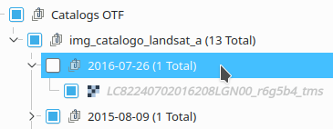
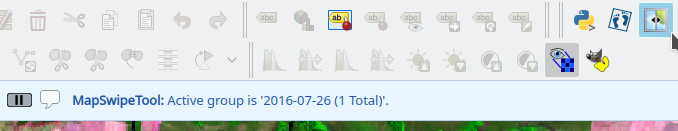

# Toggle Active Layer Plugin  

***Toggle Active Layer*** is a tool to change a visibility of a layer or a group by holding a left button of mouse.  

## Steps: ##  

* **Define a layer or a group for Toggle Active Layer Tool :**  
Select a layer or a group and active the tool.  
\* If it's a group, it needs to be visible.  
  
  

* **Active the tool :**  
Click and hold the left button of mouse, when you release the button, will change the visibility.  
  
